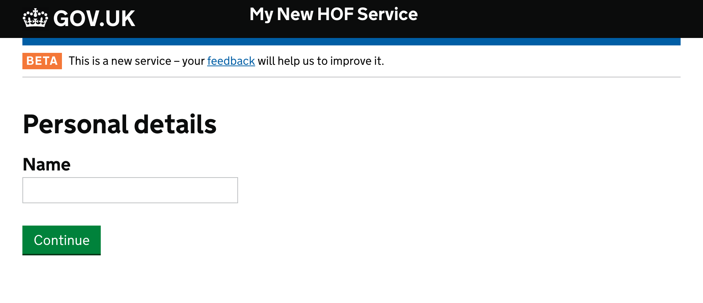

# Getting Started

## Preamble

It is expected when following these guides that you have a basic knowledge of unix terminals and are running OSX or a Linux operating system.

It is also expected that you have a working knowledge of javascript and node.js and are comfortable installing packages from npm. You should also be comfortable working with git.

## Requirements

hof is built in [node.js](https://nodejs.org/en/), and so you'll need that installed first. At present all versions 4 and above are supported, although it is recommended that you use the [latest LTS version](https://github.com/nodejs/LTS#lts-schedule).

hof also requires npm version 3 or greater. You can check your installed version by running `npm -v` and update to the latest version by running `npm install -g npm@latest`.

To run hof apps locally for development you will either need a local instance of redis running, or docker installed.

* How to [install redis on OSX](https://medium.com/@petehouston/install-and-config-redis-on-mac-os-x-via-homebrew-eb8df9a4f298#.jcwwhv7oz)
* How to [install docker on OSX](https://docs.docker.com/docker-for-mac/install/#install-and-run-docker-for-mac)

## Building your first hof form

The fastest way to create a new hof app is to use the [`hof` command line generator](https://npmjs.com/hof-generator). This will automatically create a bare-bones hof form in a directory of your choice.

### Installing the hof cli

Install the cli from npm:

```
npm install -g hof-generator
```

### Creating your first form

```
mkdir my-hof-form
cd my-hof-form
hof init
```

This will generate a brand new hof app in the directory you created.

You can then start your app by running `docker-compose up` or `npm start` (needs local redis instance).

If you open [http://localhost:8080/my-hof-form](http://localhost:8080/my-hof-form) in a browser then you should see your app. It should look something like this:



Next: [Add steps and fields to your form →](./basic-customisation).